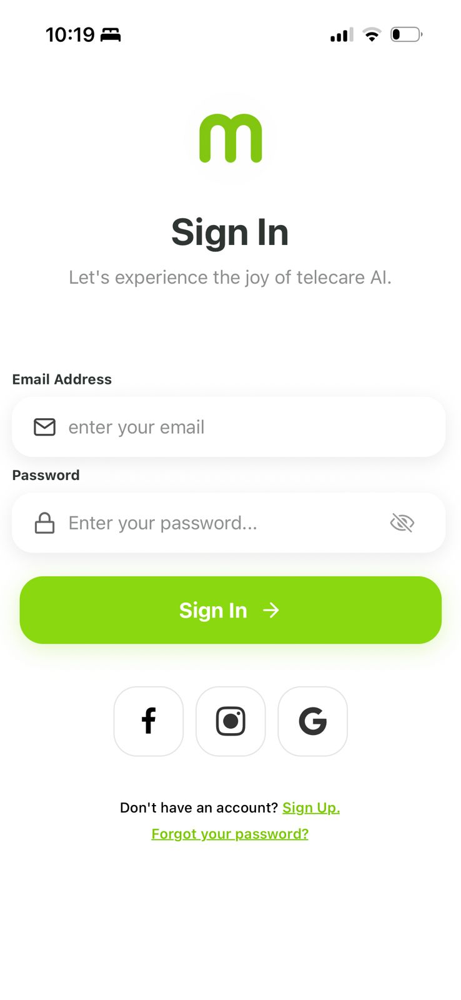
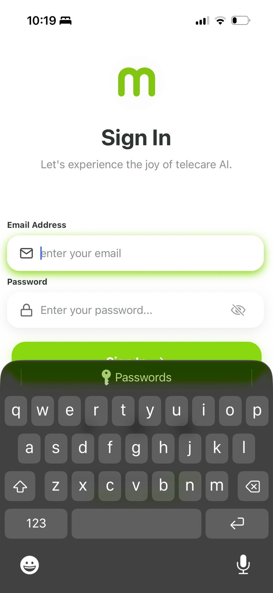

# 📱 Mobile Authentication UI (React Native + Expo)

## 🚀 Assignment Overview

In this assignment, I recreated a modern mobile authentication UI using **React Native (Expo)** and only core components.

The goal was to closely replicate a Dribbble-inspired design while focusing on:

- Layout accuracy
- Spacing and alignment
- Typography consistency
- Clean component structure

🔗 Design Reference:  
https://dribbble.com/shots/24783022-osler-AI-Telehealth-Telemedicine-App-Sign-In-Sign-Up-UI

---

## 🎯 Features Implemented

- App logo section
- Clean Sign In header UI
- Email input field with icon
- Password input field with visibility icon
- Interactive Sign In button
- Social login buttons (Google, Facebook, Instagram)
- "Sign Up" and "Forgot Password" actions
- Focus-based input styling effects

---

## 📸 My UI OUTPUT

### 🔹 Login Screen

### 🔹 Input Focus State

---
